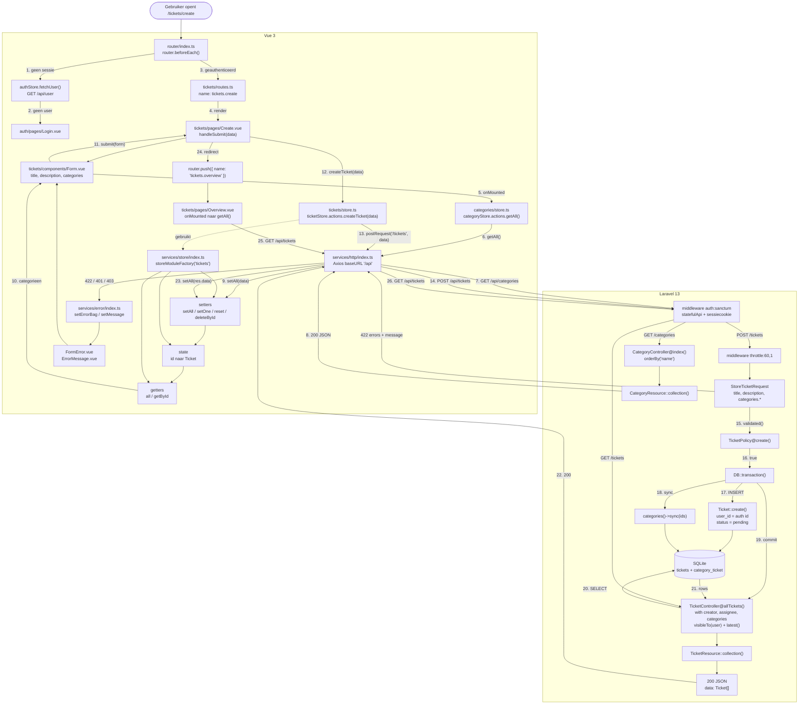
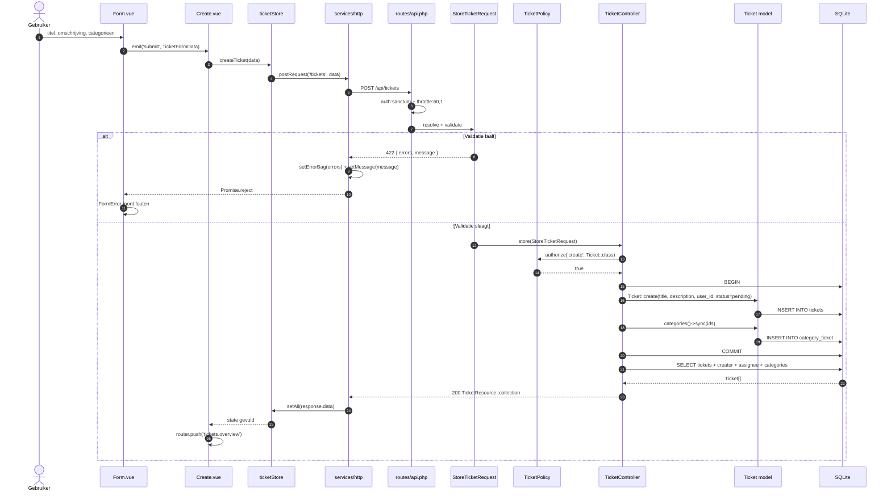
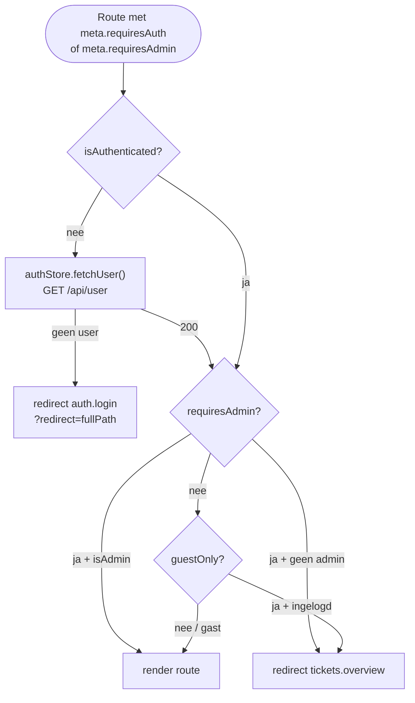
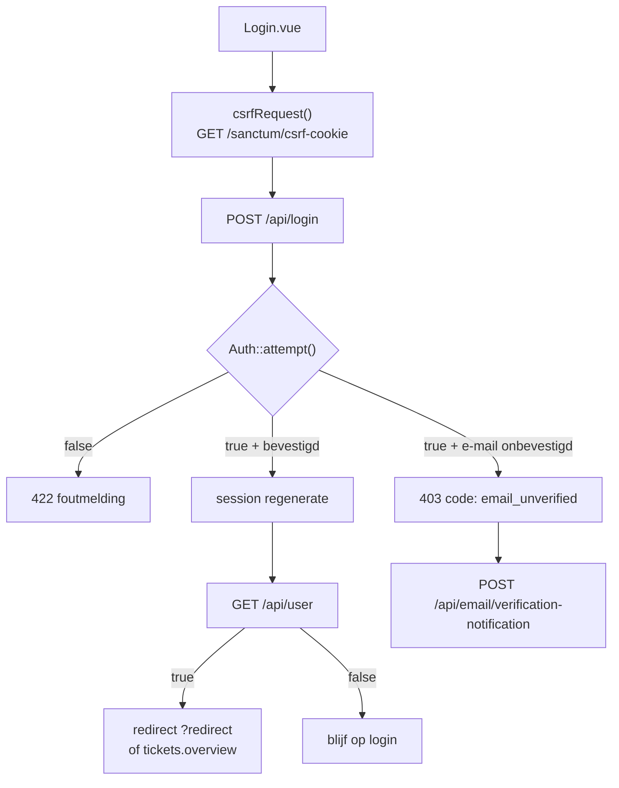
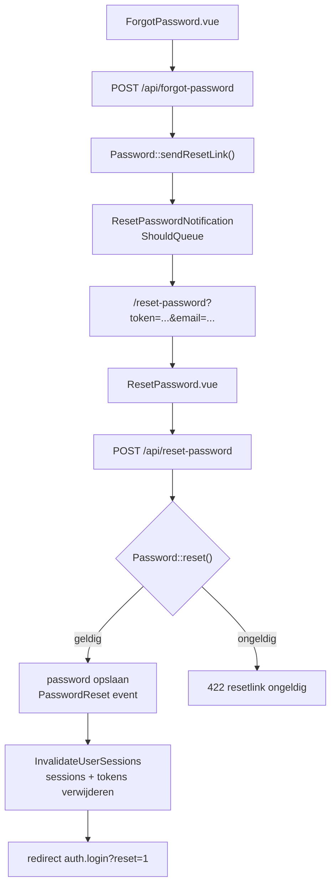
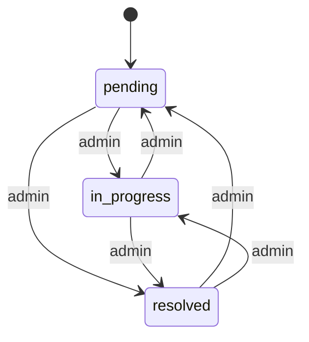
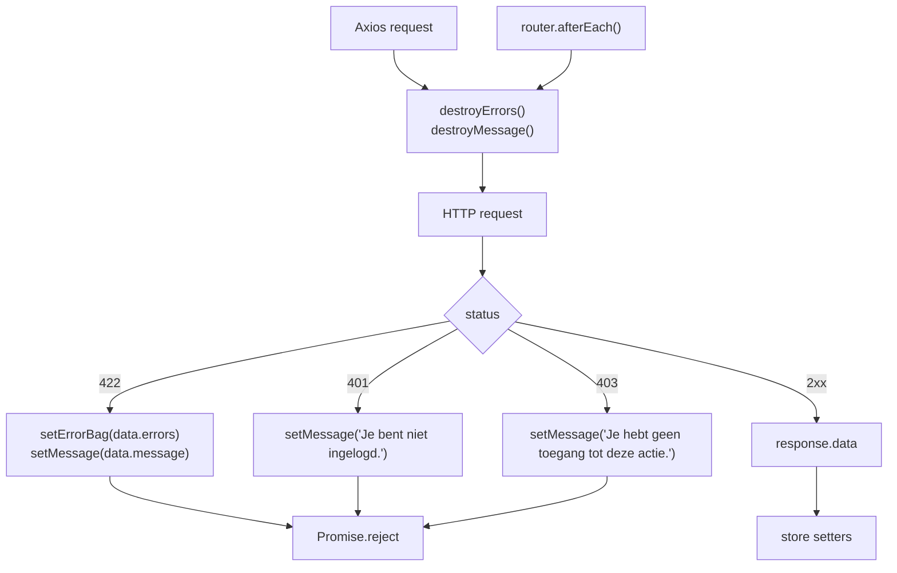

# Flowchart

## Ticket aanmaken — #4, #12

```mermaid
flowchart TD
    START(["Gebruiker opent /tickets/create"]) --> GUARD

    subgraph FE["Vue 3"]
        GUARD["router/index.ts<br/>router.beforeEach()"]
        USER["authStore.fetchUser()<br/>GET /api/user"]
        LOGIN["auth/pages/Login.vue"]
        ROUTE["tickets/routes.ts<br/>name: tickets.create"]
        CREATE["tickets/pages/Create.vue<br/>handleSubmit(data)"]
        FORM["tickets/components/Form.vue<br/>title, description, categories"]
        CATSTORE["categories/store.ts<br/>categoryStore.actions.getAll()"]
        TSTORE["tickets/store.ts<br/>ticketStore.actions.createTicket(data)"]
        FACTORY["services/store/index.ts<br/>storeModuleFactory('tickets')"]
        STATE["state<br/>id naar Ticket"]
        SETTERS["setters<br/>setAll / setOne / reset / deleteById"]
        GETTERS["getters<br/>all / getById"]
        HTTP["services/http/index.ts<br/>Axios baseURL '/api'"]
        ERROR["services/error/index.ts<br/>setErrorBag / setMessage"]
        SHOWERR["FormError.vue<br/>ErrorMessage.vue"]
        NAV["router.push({ name: 'tickets.overview' })"]
        OVERVIEW["tickets/pages/Overview.vue<br/>onMounted naar getAll()"]
    end

    subgraph BE["Laravel 13"]
        AUTH["middleware auth:sanctum<br/>statefulApi + sessiecookie"]
        THROTTLE["middleware throttle:60,1"]
        VALID["StoreTicketRequest<br/>title, description, categories.*"]
        POLICY["TicketPolicy@create()"]
        TX["DB::transaction()"]
        MODEL["Ticket::create()<br/>user_id = auth id<br/>status = pending"]
        PIVOT["categories()->sync(ids)"]
        DB[("SQLite<br/>tickets + category_ticket")]
        ALLTICKETS["TicketController@allTickets()<br/>with creator, assignee, categories<br/>visibleTo(user) + latest()"]
        RESOURCE["TicketResource::collection()"]
        JSON["200 JSON<br/>data: Ticket[]"]
        CATAPI["CategoryController@index()<br/>orderBy('name')"]
        CATRES["CategoryResource::collection()"]
    end

    GUARD -->|"1. geen sessie"| USER
    USER -->|"2. geen user"| LOGIN
    GUARD -->|"3. geauthenticeerd"| ROUTE
    ROUTE -->|"4. render"| CREATE
    CREATE --> FORM
    FORM -->|"5. onMounted"| CATSTORE
    CATSTORE -->|"6. getAll()"| HTTP
    HTTP -->|"7. GET /api/categories"| AUTH
    AUTH -->|"GET /categories"| CATAPI
    CATAPI --> CATRES
    CATRES -->|"8. 200 JSON"| HTTP
    HTTP -->|"9. setAll(data)"| SETTERS
    SETTERS --> STATE
    STATE --> GETTERS
    GETTERS -->|"10. categorieen"| FORM
    FORM -->|"11. submit(form)"| CREATE
    CREATE -->|"12. createTicket(data)"| TSTORE
    TSTORE -.->|"gebruikt"| FACTORY
    FACTORY --> STATE
    FACTORY --> SETTERS
    FACTORY --> GETTERS
    TSTORE -->|"13. postRequest('/tickets', data)"| HTTP
    HTTP -->|"14. POST /api/tickets"| AUTH
    AUTH -->|"POST /tickets"| THROTTLE
    THROTTLE --> VALID
    VALID -->|"422 errors + message"| HTTP
    HTTP -->|"422 / 401 / 403"| ERROR
    ERROR --> SHOWERR
    SHOWERR --> FORM
    VALID -->|"15. validated()"| POLICY
    POLICY -->|"16. true"| TX
    TX -->|"17. INSERT"| MODEL
    MODEL --> DB
    TX -->|"18. sync"| PIVOT
    PIVOT --> DB
    TX -->|"19. commit"| ALLTICKETS
    ALLTICKETS -->|"20. SELECT"| DB
    DB -->|"21. rows"| ALLTICKETS
    ALLTICKETS --> RESOURCE
    RESOURCE --> JSON
    JSON -->|"22. 200"| HTTP
    HTTP -->|"23. setAll(res.data)"| SETTERS
    CREATE -->|"24. redirect"| NAV
    NAV --> OVERVIEW
    OVERVIEW -->|"25. GET /api/tickets"| HTTP
    HTTP -->|"26. GET /api/tickets"| AUTH
    AUTH -->|"GET /tickets"| ALLTICKETS
```

## Request/response — #12, #22

```mermaid
sequenceDiagram
    autonumber
    actor U as Gebruiker
    participant F as Form.vue
    participant C as Create.vue
    participant S as ticketStore
    participant H as services/http
    participant R as routes/api.php
    participant V as StoreTicketRequest
    participant P as TicketPolicy
    participant T as TicketController
    participant M as Ticket model
    participant D as SQLite

    U->>F: titel, omschrijving, categorieen
    F->>C: emit('submit', TicketFormData)
    C->>S: createTicket(data)
    S->>H: postRequest('/tickets', data)
    H->>R: POST /api/tickets
    R->>R: auth:sanctum + throttle:60,1
    R->>V: resolve + validate

    alt Validatie faalt
        V-->>H: 422 { errors, message }
        H->>H: setErrorBag(errors) + setMessage(message)
        H-->>F: Promise.reject
        F->>F: FormError toont fouten
    else Validatie slaagt
        V->>T: store(StoreTicketRequest)
        T->>P: authorize('create', Ticket::class)
        P-->>T: true
        T->>D: BEGIN
        T->>M: Ticket::create(title, description, user_id, status=pending)
        M->>D: INSERT INTO tickets
        T->>M: categories()->sync(ids)
        M->>D: INSERT INTO category_ticket
        T->>D: COMMIT
        T->>D: SELECT tickets + creator + assignee + categories
        D-->>T: Ticket[]
        T-->>H: 200 TicketResource::collection
        H->>S: setAll(response.data)
        S-->>C: state gevuld
        C->>C: router.push('tickets.overview')
    end
```

## Authenticatie — #5, #6, #7, #11

```mermaid
flowchart TD
    ROUTE(["Route met meta.requiresAuth<br/>of meta.requiresAdmin"]) --> CHECK{"isAuthenticated?"}
    CHECK -->|"nee"| FETCH["authStore.fetchUser()<br/>GET /api/user"]
    FETCH -->|"geen user"| REDIR["redirect auth.login<br/>?redirect=fullPath"]
    FETCH -->|"200"| ADMIN{"requiresAdmin?"}
    CHECK -->|"ja"| ADMIN
    ADMIN -->|"ja + isAdmin"| RENDER["render route"]
    ADMIN -->|"ja + geen admin"| HOME["redirect tickets.overview"]
    ADMIN -->|"nee"| GUEST{"guestOnly?"}
    GUEST -->|"ja + ingelogd"| HOME
    GUEST -->|"nee / gast"| RENDER
```

```mermaid
flowchart TD
    LOGIN["Login.vue"] --> CSRF["csrfRequest()<br/>GET /sanctum/csrf-cookie"]
    CSRF --> POST["POST /api/login"]
    POST --> CRED{"Auth::attempt()"}
    CRED -->|"false"| E422["422 foutmelding"]
    CRED -->|"true + e-mail onbevestigd"| E403["403 code: email_unverified"]
    CRED -->|"true + bevestigd"| REGEN["session regenerate"]
    REGEN --> ME["GET /api/user"]
    ME -->|"true"| TARGET["redirect ?redirect<br/>of tickets.overview"]
    ME -->|"false"| STAY["blijf op login"]
    E403 --> RESEND["POST /api/email/verification-notification"]
```

```mermaid
flowchart TD
    FORGOT["ForgotPassword.vue"] --> FP["POST /api/forgot-password"]
    FP --> LINK["Password::sendResetLink()"]
    LINK --> MAIL["ResetPasswordNotification<br/>ShouldQueue"]
    MAIL --> URL["/reset-password?token=...&amp;email=..."]
    URL --> RESET["ResetPassword.vue"]
    RESET --> RP["POST /api/reset-password"]
    RP --> CHECK{"Password::reset()"}
    CHECK -->|"geldig"| SAVE["password opslaan<br/>PasswordReset event"]
    SAVE --> INVALIDATE["InvalidateUserSessions<br/>sessions + tokens verwijderen"]
    INVALIDATE --> DONE["redirect auth.login?reset=1"]
    CHECK -->|"ongeldig"| FAIL["422 resetlink ongeldig"]
```

## Ticketstatus — #17

```mermaid
stateDiagram-v2
    [*] --> pending
    pending --> in_progress: admin
    pending --> resolved: admin
    in_progress --> pending: admin
    in_progress --> resolved: admin
    resolved --> pending: admin
    resolved --> in_progress: admin
```

## Foutafhandeling — #12, #22, #25

```mermaid
flowchart TD
    REQ["Axios request"] --> CLEAR["destroyErrors()<br/>destroyMessage()"]
    CLEAR --> SEND["HTTP request"]
    SEND --> STATUS{"status"}
    STATUS -->|"422"| E422["setErrorBag(data.errors)<br/>setMessage(data.message)"]
    STATUS -->|"401"| E401["setMessage('Je bent niet ingelogd.')"]
    STATUS -->|"403"| E403["setMessage('Je hebt geen toegang tot deze actie.')"]
    STATUS -->|"2xx"| OK["response.data"]
    E422 --> REJECT["Promise.reject"]
    E401 --> REJECT
    E403 --> REJECT
    OK --> STORE["store setters"]
    AFTER["router.afterEach()"] --> CLEAR
```
